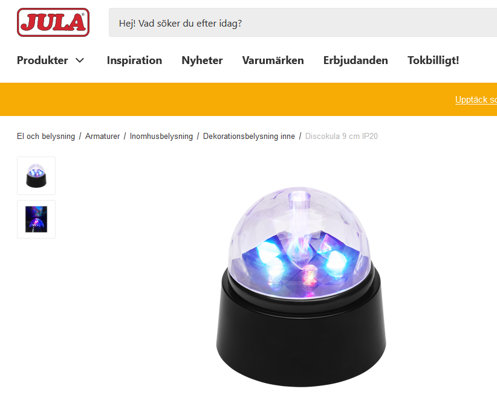
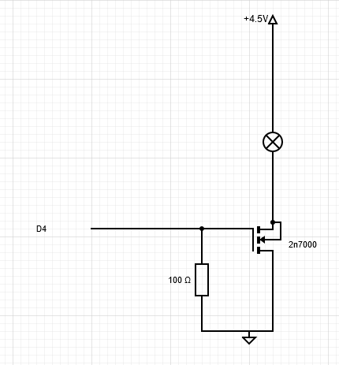
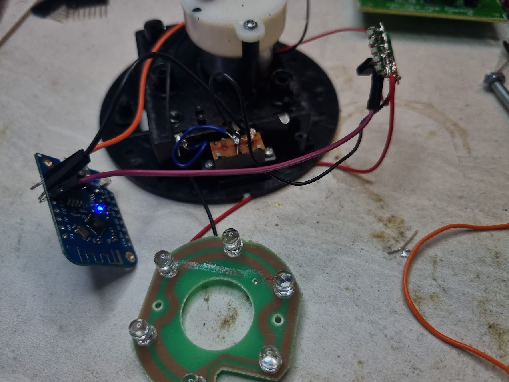

# What is this craziness?

Knowing when to stop work and start disco dancing is a real problem we all struggle with!

This is a proof-of-concept demo of pulling genre info from Spotify (there are limitations... read on) to control a desktop disco ball.

# Demo

Switching from Beach Boys to Funky Town: 

# Disco ball mod

I acquired a  [cheap battery-powered disco ball from Jula](https://www.jula.se/catalog/el-och-belysning/armaturer/inomhusbelysning/dekorationsbelysning/discokula-002379/) for other reasons a couple of months ago.
The inside is about the size of a Wemos mini, which was coupled with a 2n7000 to control motor and LED power. 

When dismantling the ball, I noticed that the cabling is odd: it uses red for negative and black for positive. Check the connections to the battery holder before wiring up things.
Connect gate on the 2n7000 to D4 on the Wemos mini. Shrink tube the transistor once everything works okay and tape the wemos to the motor to keep it in place while reassembling. 

# Software

Right now, the software consists of two components:

## esphome on the disco ball

This can/should be replaced by a micropython/similar instance talking to spotify directly. Edit the esphome template for your settings, upload using esphome.

[https://esphome.io/guides/getting_started_command_line.html]

## a small python script

The script uses Spotipy to get the information. 
Copy secret.py.template to secret.py, create your own app att [https://developer.spotify.com/], add the Client ID, Client Secret to the secret.py file. Also add your Spotify username.
When running the script, it will pop up a web browser to do the authentication towards Spotify.

## limitations

* The script polls Spotify every 10 seconds for updates to what is played. This is not very efficient and I have no idea if it will hit any rate limits or not.
* Spotify doesn't provide genre per track, only per artist. If the artist matches disco, the ball starts. Obviously, this will lead to false positives.
* The ball must be called "disco", and the light output must be called "lampa", or things will fail horribly.

